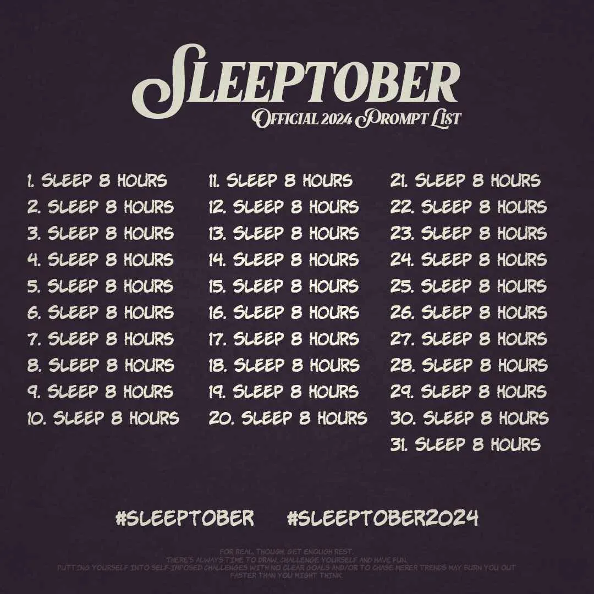

#  Sleeptober Discord Bot

This repo hosts the source for a Discord bot made to handle logging hours slept for Sleeptober.

It features basic functionality, such as manually logging sleep (`>>=slept ...`), viewing one's profile (`>>=profile`), and viewing a leaderboard of Sleeptober participants (`>>=leaderboard`).

## How to run

Requirements:
- A file `sleeptober-bot_config.json` with contents of the form: `{'token': 'Discord Bot Token Here', 'admin_ids': ['Discord User ID Here', ...]}` (i.e. containing the Discord bot token as string and a (possibly empty) list of 'bot admin' user IDs in plain text.)

The following commands can be run in terminal on Linux to start the bot:
```bash
# Makes a new virtual environment.
python3 -m venv sleeptober-bot_venv
# Enters virtual environment.
source sleeptober-bot_venv/bin/activate
# Installs discord.py dependency.
pip install discord
# Starts bot (requires sleeptober-bot_config.json).
python3 sleeptober-bot_main.py
```

A file `sleeptober-bot_data.json` (containing bot data) will be automatically created if it doesn't exist.


# Sleeptober

> Sleeptober was created as a challenge to improve one's sleeping skills and develop positive sleeping habits.



*This bot is developed heavily ad-hoc and just for fun :-)
